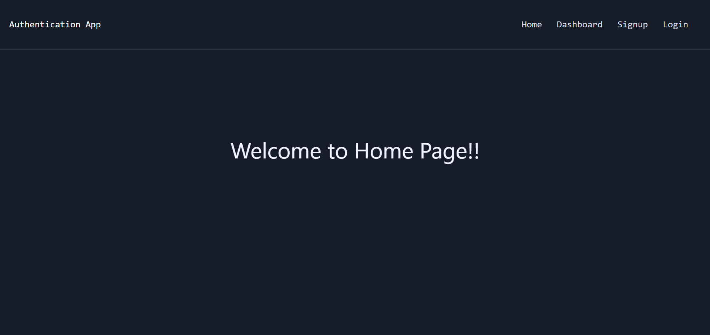
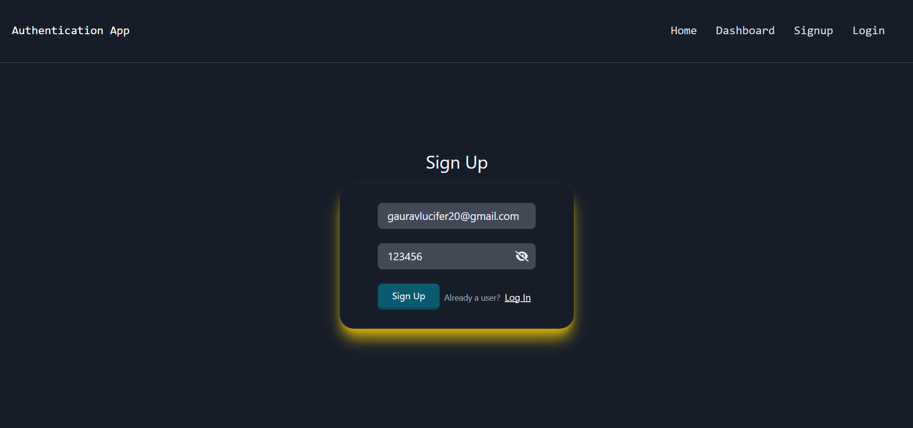
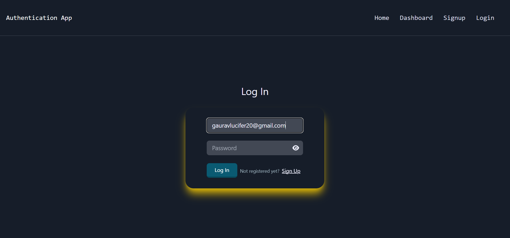
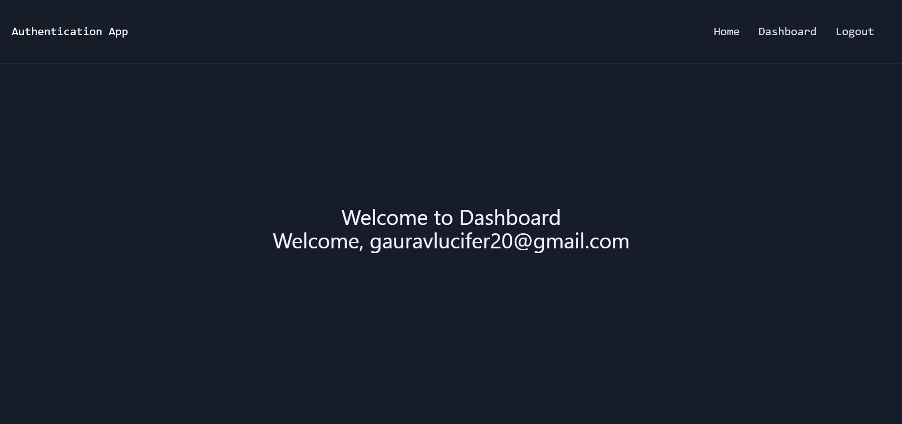
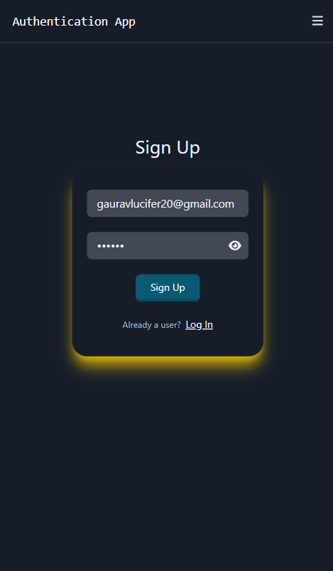

# Firebase Authentication
This is a simple authentication demo using Firebase and React. The application allows users to sign up, log in, and access a protected dashboard. Only verified users can log in and access the dashboard.

## Features

- User Registration
- User Login
- Email Verification
- Protected Routes
- Logout Functionality
- Display user-specific data on the Dashboard

## Technologies Used

- React JS
- Firebase Authentication
- Tailwind CSS
- React Router

## Live Demo 

   [AuthApp](https://authenticationappfirebase.netlify.app/)

## Screenshots
**Home Page**


**Signup Page**


**Login Page**


**Dashboard**





## Setup
### Prerequisites

- Node.js
- npm 

### Firebase Setup

1. Create a Firebase project at [Firebase Console](https://console.firebase.google.com/).
2. Set up Firebase Authentication with email/password.
3. Enable Firestore in your Firebase project.


## Installation

1. **Clone the repository:**

   ```bash
   git clone https://github.com/G17aurav/Authentication_firebase.git

2. **Navigate to the project directory:**

   ```bash
   cd Authentication_firebase
   
4. **Install dependencies:**

   ```bash
   npm install

5. **Run the application**

   ```bash
   npm run dev
   
